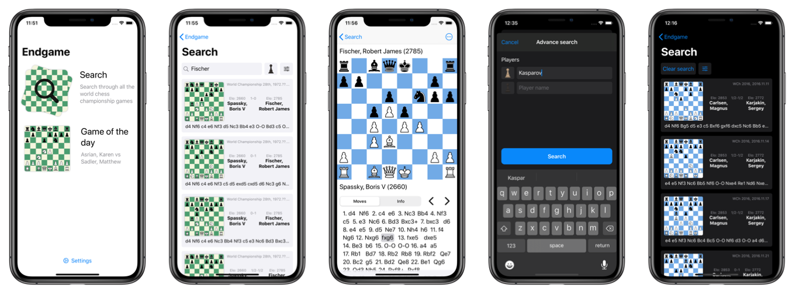

# Portafolio

## About me:

My name is Jorge and I live in Monterrey, Mexico. Since I was a kid I liked computers, I still remember when my parents bought my first computer, an Apple MacBook. It felt like magic, although when I found out that the Mac Operative System did not run games like the Windows computers did the magic wore off. That’s when I started to play the only game that ran in my Mac, chess. To me it seems that I always knew how to play chess, as if I was born knowing the game, of course that is not the case. I started getting into chess in high school and started representing my schools by competing in some tournaments in Mexico. At the same time I started my career in Software Engineering, fully concentrating in developing iOS applications. To follow up on my career I interned as a iOS developer in a local start up where I worked halftime while finishing my education. Also I had the opportunity to study abroad as an exchange student in Aalborg University in Denmark, it was the best time of my life, I made many friends and learned a lot. When I finish my computer degree in ITESM (College in Monterrey, Mexico) I started working right away in Inflection Point as an iOS Developer, where I continue to work to the present date. Lastly I developed Endgame: chess database, an iOS Application about chess which is a product of the convergence of my career and hobby.

## Personal Projects:

###   Endgame: chess database

I always loved chess and computers, Endgame is a convergence of both my passions. An iOS application, that lets users see all the world championship games. I developed this application on my free time and it’s the project that I’m the most proud of. Endgame: chess database can be found in the App Store.

   

       
